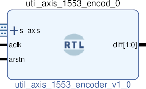

# UTIL AXIS 1553 ENCODER
## AXIS TO MIL-STD-1553
---

   author: Jay Convertino   
   
   date: 2021.05.17  
   
   details: Incoming AXI streaming data is used to create a MIL-STD-1553 compliant signal.   
   
   license: MIT   
   
---

### IP USAGE
#### INSTRUCTIONS

TDATA input should contain the 16 bit data payload. TUSER is a 8 bit command register   
that takes a discription what type of data it is (command or data) and other options.   
described below.   

* TUSER = {TYY,NA,D,I,P} (7 downto 0)
  * TYY = TYPE OF DATA
    * 000 N/A
    * 001 REG (NOT IMPLIMENTED)
    * 010 DATA
    * 100 CMD/STATUS
  * NA = RESERVED FOR FUTURE USE.
  * D = DELAY ENABLED
    * 1 = 4 us delay enabled.
    * 0 = no delay between transmissions.
  * I = INVERT DATA
    * 1 = Invert data.
    * 0 = Normal data.
  * P = PARITY
    * 1 = ODD
    * 0 = EVEN

#### PARAMETERS

* clock_speed : DEFAULT = 2000000 : clock speed of aclk to the core in hz.
* sample_rate : DEFAULT = 2000000 : sample rate of generated signal in hz (minimum 2 MHz).

### COMPONENTS
#### SRC

* util_axis_1553_encoder.v
  
#### TB

* tb_1553_enc.vhd
  
### Makefile

* Capable of generating simulations and ip cores for the project.

#### Usage

##### Icarus

* make icarus      - Generate project using Icarus.
* make icarus_sim  - Simulate project using Icarus.
* make icarus_view - Open GTKwave to view simulation.

##### XSim (Vivado)

* make xsim      - Generate Vivado project for simulation.
* make xsim_view - Open Vivado to run simulation.
* make xsim_sim  - Run xsim for a certain amount of time.
  * STOP_TIME ... argument can be passed to change time that the simulation stops (+1000ns, default vivado run time).
  * TB_ARCH ... argument can be passed to change the target configuration for simulation.
* make xsim_gtkwave_view - Use gtkwave to view vcd dump file.

##### IP Core (Vivado)

* make - Create Packaged IP core for Vivado, also builds all sims.
