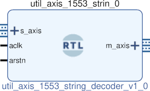

# UTIL AXIS 1553 STRING DECODER
## AXIS string to 1553 decoder
---

   author: Jay Convertino   
   
   date: 2021.06.21  
   
   details: Take a carrige return terminated string and format it to 1553 encoder core data input.  
   
   license: MIT   
   
---

### IP USAGE
#### INSTRUCTIONS

This ip core looks for a 21 character carrige return terminated input.   
If the data is not the correct length and not terminated properly it will be ignored.  
If it is correct the data will be parsed in a clock cycle and output to the m_axis   
data output. It's output is compatible with the 1553 encoder input format for AXIS.  

* FORMAT OF THE STRING:
  * SYNC;D?;P?;I?;Hx????\cr
  * EXAMPLE: DATA;D0;P1;I0;HxBEEF
  * SYNC = DATA, CMDS, or NANA
    * DATA is data sync.
    * CMDS is command/status sync.
    * NANA is no sync.
  * D? enable 4us delay between transmissons.
    * 1 = delay enable.
    * 0 = delay disable.
  * P? parity type
    * 1 = parity odd (standard).
    * 0 = parity even (non-standard).
  * I? invert data
    * 1 = invert data.
    * 0 = do not invert data.
  * Hx???? data received
    * 16 bit hex of data to transmit (???? is the data).
  * \cr each string has a carrige return printed at the end for seperation.
  
#### Parameters

  * byte_swap : DEFAULT = 0 : Enable byte swapping of the input data (1 = enabled, 0 = disabled).

### COMPONENTS
#### SRC

* util_axis_1553_string_decoder.v
  
#### TB

* tb_decoder.vhd
  
### Makefile

* Capable of generating simulations and ip cores for the project.

#### Usage

##### Icarus

* make icarus      - Generate project using Icarus.
* make icarus_sim  - Simulate project using Icarus.
* make icarus_view - Open GTKwave to view simulation.

##### XSim (Vivado)

* make xsim      - Generate Vivado project for simulation.
* make xsim_view - Open Vivado to run simulation.
* make xsim_sim  - Run xsim for a certain amount of time.
  * STOP_TIME ... argument can be passed to change time that the simulation stops (+1000ns, default vivado run time).
  * TB_ARCH ... argument can be passed to change the target configuration for simulation.
* make xsim_gtkwave_view - Use gtkwave to view vcd dump file.

##### IP Core (Vivado)

* make - Create Packaged IP core for Vivado, also builds all sims.
