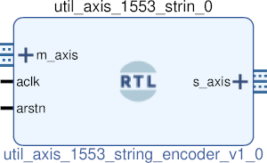

# UTIL AXIS 1553 STRING ENCODER
## AXIS 1553 to string envoder
---

   author: Jay Convertino   
   
   date: 2021.06.21  
   
   details: Take 16 bit 1553 data and a 8 command(tuser) word and convert it to string.  
   
   license: MIT   
   
---

### IP USAGE
#### INSTRUCTIONS

Take 16 bit data and 8 bit tuser data from decoder and generate a string. The string  
will have the following format.   

* FORMAT OF THE STRING:
  * SYNC;D?;P?;I?;Hx????\cr
  * EXAMPLE: DATA;D0;P1;I0;HxBEEF
  * SYNC = DATA, CMDS, or NANA
    * DATA is data sync.
    * CMDS is command/status sync.
    * NANA is unidentified sync.
  * D? is delay enabled.
    * This should always be D0, since this core is for receive only (delay for transmit).
  * P? parity check
    * 1 = parity good.
    * 0 = parity bad.
  * I? inverted data
    * 1 = data invert for core gen enabled.
    * 0 = data invert for core gen disabled.
  * Hx???? data received
    * 16 bit hex of the data word received (???? is the data).
  * \cr each string has a carrige return printed at the end for seperation.
  
#### Parameters

  * byte_swap : DEFAULT = 0 : Byte swap output data bytes. (1 = enabled, 0 = disabled).

### COMPONENTS
#### SRC

* util_axis_1553_string_encoder.v
  
#### TB

* tb_encoder.vhd
  
### Makefile

* Capable of generating simulations and ip cores for the project.

#### Usage

##### Icarus

* make icarus      - Generate project using Icarus.
* make icarus_sim  - Simulate project using Icarus.
* make icarus_view - Open GTKwave to view simulation.

##### XSim (Vivado)

* make xsim      - Generate Vivado project for simulation.
* make xsim_view - Open Vivado to run simulation.
* make xsim_sim  - Run xsim for a certain amount of time.
  * STOP_TIME ... argument can be passed to change time that the simulation stops (+1000ns, default vivado run time).
  * TB_ARCH ... argument can be passed to change the target configuration for simulation.
* make xsim_gtkwave_view - Use gtkwave to view vcd dump file.

##### IP Core (Vivado)

* make - Create Packaged IP core for Vivado, also builds all sims.
