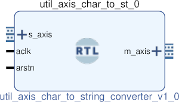

# UTIL AXIS CHAR TO STRING CONVERTER
## Simple converter from char to strings.
---

   author: Jay Convertino   
   
   date: 2021.06.21  
   
   details: Simple converter from char to strings. Up to full size or \cr is received.  
   
   license: MIT   
   
---

### IP USAGE
#### INSTRUCTIONS

Input chars to build up a string of some length set by the number of bytes in the master  
output. This can also terminate with valid data early if \cr is encountered in the data.   

#### PARAMETERS
* master_width : DEFAULT = 1 : Number of bytes for input string.

### COMPONENTS
#### SRC

* util_axis_char_to_string_converter.v
  
#### TB

* tb_converter.v
  
### Makefile

* Capable of generating simulations and ip cores for the project.

#### Usage

##### Icarus

* make icarus      - Generate project using Icarus.
* make icarus_sim  - Simulate project using Icarus.
* make icarus_view - Open GTKwave to view simulation.

##### XSim (Vivado)

* make xsim      - Generate Vivado project for simulation.
* make xsim_view - Open Vivado to run simulation.
* make xsim_sim  - Run xsim for a certain amount of time.
  * STOP_TIME ... argument can be passed to change time that the simulation stops (+1000ns, default vivado run time).
  * TB_ARCH ... argument can be passed to change the target configuration for simulation.
* make xsim_gtkwave_view - Use gtkwave to view vcd dump file.

##### IP Core (Vivado)

* make - Create Packaged IP core for Vivado, also builds all sims.
