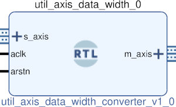

# UTIL AXIS DATA WIDTH CONVERTER
## Simple data width converted for ratios that divide into one another.
---

   author: Jay Convertino   
   
   date: 2021.06.21  
   
   details: Simple data width converter for axis devices. Data widths must divide evenly.  
   
   license: MIT   
   
---

### IP USAGE
#### INSTRUCTIONS

This data width converter is for even integer divides of slave to master or  
master to slave. Example this core can go from 4 bytes to 2 bytes or 2 bytes to   
4 bytes. It can not go from 5 bytes to 2 bytes or 2 bytes to 5 bytes. 4/2 is 2, a   
round number. 5/2 is a fractional number that will not work with this core.  

#### PARAMETERS

* slave_width  : DEFAULT = 1 : Slave width in bytes.
* master_width : DEFAULT = 1 : Master width in bytes.

### COMPONENTS
#### SRC

* util_axis_data_width_converter.v
  
#### TB

* tb_converter.v
  
### Makefile

* Capable of generating simulations and ip cores for the project.

#### Usage

##### Icarus

* make icarus      - Generate project using Icarus.
* make icarus_sim  - Simulate project using Icarus.
* make icarus_view - Open GTKwave to view simulation.

##### XSim (Vivado)

* make xsim      - Generate Vivado project for simulation.
* make xsim_view - Open Vivado to run simulation.
* make xsim_sim  - Run xsim for a certain amount of time.
  * STOP_TIME ... argument can be passed to change time that the simulation stops (+1000ns, default vivado run time).
  * TB_ARCH ... argument can be passed to change the target configuration for simulation.
* make xsim_gtkwave_view - Use gtkwave to view vcd dump file.

##### IP Core (Vivado)

* make - Create Packaged IP core for Vivado, also builds all sims.
