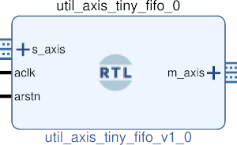

# UTIL AXIS FIFO
## Simple single clock fifo
---

   author: Jay Convertino   
   
   date: 2021.06.02  
   
   details: Simple axis single clock pipeline fifo.  
   
   license: MIT   
   
---

### IP USAGE
#### INSTRUCTIONS

Pipeline method axis fifo. This fifo uses a pipeline to create a fifo. Meaning  
it has a latency the size of the depth. If the output receiving core is not ready  
the core will build up data till it is full. All data will have a latency of the depth.   

#### PARAMETERS
* depth : DEFAULT = 4 : Set the depth of the single clock fifo (number of words the size of width).
* width : DEFAULT = 8 : Set the data width of the fifo in bits.

### COMPONENTS
#### SRC

* util_axis_tiny_fifo.v
  
#### TB

* tb_fifo.vhd
  
### Makefile

* Capable of generating simulations and ip cores for the project.

#### Usage

##### Icarus

* make icarus      - Generate project using Icarus.
* make icarus_sim  - Simulate project using Icarus.
* make icarus_view - Open GTKwave to view simulation.

##### XSim (Vivado)

* make xsim      - Generate Vivado project for simulation.
* make xsim_view - Open Vivado to run simulation.
* make xsim_sim  - Run xsim for a certain amount of time.
  * STOP_TIME ... argument can be passed to change time that the simulation stops (+1000ns, default vivado run time).
  * TB_ARCH ... argument can be passed to change the target configuration for simulation.
* make xsim_gtkwave_view - Use gtkwave to view vcd dump file.

##### IP Core (Vivado)

* make - Create Packaged IP core for Vivado, also builds all sims.
