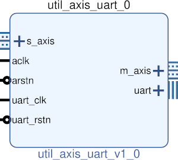

# UTIL AXIS UART
## UART TO AXIS
---

   author: Jay Convertino   
   
   date: 2021.06.23  
   
   details: Interface UART data at some baud to a axi streaming 8 bit interface.   
   
   license: MIT   
   
---

### IP USAGE
#### INSTRUCTIONS

Simple UART core for TTL rs232 software mode data communications. No hardware handshake.  
This contains its own internal baud rate generator that creates an enable to allow data output  
or sampling. Baud clock and aclk can be the same clock.  

#### PARAMETERS
* baud_clock_speed : DEFAULT = 2000000 : Clock speed of the baud clock. Best if it is a integer multiple of the baud rate, but does not have to be.
* baud_rate : DEFAULT = 2000000 : Baud rate of the input/output data for the core.
* parity_ena : DEFAULT = 1 : Enable parity check and generate.
* parity_type : DEFAULT = 1 : Set the parity type, 0 = even, 1 = odd, 2 = mark, 3 = space.
* stop_bits : DEFAULT = 1 : Number of stop bits, 0 to crazy non-standard amounts.
* data_bits : DEFAULT = 8 : Number of data bits, 1 to crazy non-standard amounts.
* rx_delay : DEFAULT = 0 : Delay in rx data input.
* rx_baud_delay : DEFAULT = 0 : Delay in rx baud enable. This will delay when we sample a bit (default is midpoint when rx delay is 0).
* tx_delay : DEFAULT = 0 : Delay in tx data output. Delays the time to output of the data.
* tx_baud_delay : DEFAULT = 0 : Delay in tx baud enable. This will delay the time the bit output starts.

### COMPONENTS
#### SRC

* util_axis_uart.v
* util_axis_uart_tx.v
* util_axis_uart_rx.v
* util_uart_baud_gen.v
  
#### TB

* tb_uart.v
* tb_uart_tx.v
* tb_uart_rx.v
* tb_uart_baud_gen.v
  
### Makefile

* Capable of generating simulations and ip cores for the project.

#### Usage

#### Subprojects

* make txd  ??? - generate sim for txd only, ??? is optional and can be xsim or icarus.
* make rxd  ??? - generate sim for rxd only, ??? is optional and can be xsim or icarus.
* make baud ??? - generate sim for baudd only, ??? is optional and can be xsim or icarus.

##### Icarus

* make icarus      - Generate project using Icarus.
* make icarus_sim  - Simulate project using Icarus.
* make icarus_view - Open GTKwave to view simulation.

##### XSim (Vivado)

* make xsim      - Generate Vivado project for simulation.
* make xsim_view - Open Vivado to run simulation.
* make xsim_sim  - Run xsim for a certain amount of time.
  * STOP_TIME ... argument can be passed to change time that the simulation stops (+1000ns, default vivado run time).
  * TB_ARCH ... argument can be passed to change the target configuration for simulation.
* make xsim_gtkwave_view - Use gtkwave to view vcd dump file.

##### IP Core (Vivado)

* make - Create Packaged IP core for Vivado, also builds all sims.
