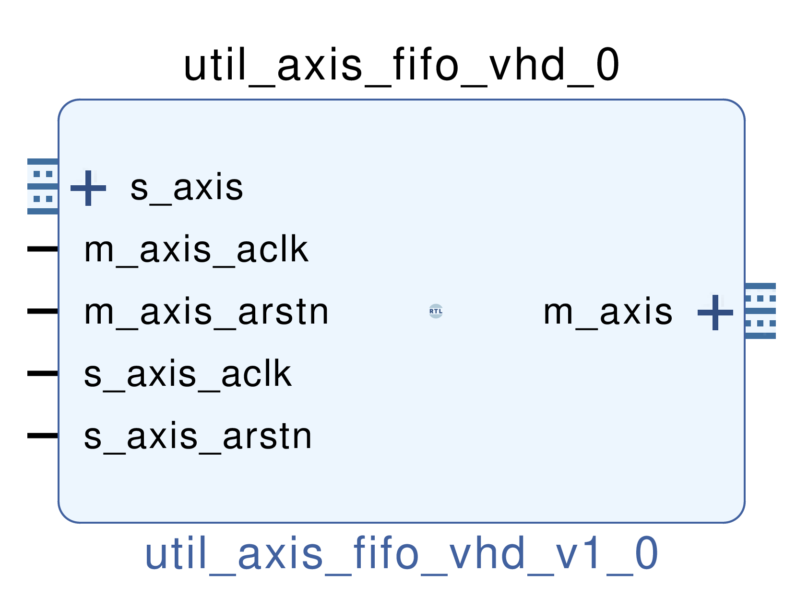

# AXIS FIFO
## Fifo for AXI streaming
---

   author: Jay Convertino  
   
   date: 2021.06.29  
   
   details: Verilog AXIS FIFO provides a dual clock FIFO capable of async or sync clocks.  
   
   license: MIT   
   
---

### IP USAGE
#### Parameters

* FIFO_DEPTH : Depth of the fifo, must be a power of two number(divisable aka 256 = 2^8). Any non-power of two will be rounded up to the next closest.
* COUNT_WIDTH: Data count output width in bits. Should be the same power of two as fifo depth(256 for fifo depth... this should be 8).
* BUS_WIDTH  : Width of the axis data bus input/output in bytes.
* USER_WIDTH : Width of the axis user bus input/output in bits.
* DEST_WIDTH : Width of the axis dest bus input/output in bits.
* RAM_TYPE   : RAM type setting.
* PACKET_MODE: Set axis fifo to wait for tlast before allowing a read on master port output.
* COUNT_DELAY: Delay count by one clock cycle of the data count clock. Set this to 0 to disable (only disable if read/write/data_count are on the same clock domain!). 

### COMPONENTS
#### SRC

* util_axis_fifo_ctrl.v
  * controls axis fifo behavior.
* util_axis_fifo.v
  * Wrapper for axis fifo components.
  
#### TB

* tb_axi.vhd
  * Axi test bench for control and streaming data.
* tbv_axi.vhd
  * Axi test bench vectors.
  
#### Makefile

* Capable of generating simulation projects for GHDL and Xsim(Vivado).

##### Usage

###### XSim (Vivado)

* make xsim      - Generate Vivado project for simulation.
* make xsim_view - Open Vivado to run simulation.
* make xsim_sim  - Run xsim for a certain amount of time.
  * STOP_TIME ... argument can be passed to change time that the simulation stops (+1000ns, default vivado run time).
  * TB_ARCH ... argument can be passed to change the target configuration for simulation.
* make xsim_gtkwave_view - Use gtkwave to view vcd dump file.
