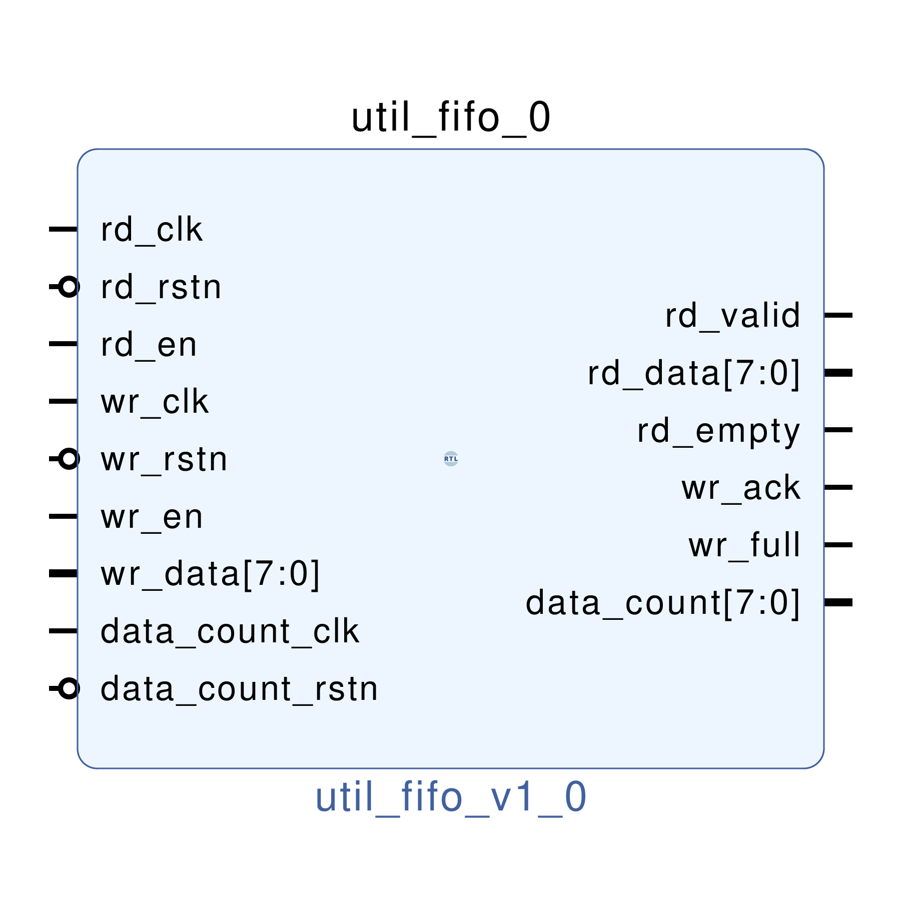

# UTIL FIFO
## Emulates Xilinx FIFO FWFT and response
---

   author: Jay Convertino  
   
   date: 2021.06.29  
   
   details: Generic FIFO provides a dual clock FIFO capable of async or sync clocks. It also provides a clocked data_count that tells the user how much data is in the fifo.  
   
   license: MIT   
   
---

### IP USAGE
#### Parameters

* FIFO_DEPTH : Depth of the fifo, must be a power of two number(divisable aka 256 = 2^8). Any non-power of two will be rounded up to the next closest.
* COUNT_WIDTH: Data count output width in bits. Should be the same power of two as fifo depth(256 for fifo depth... this should be 8).
* BYTE_WIDTH : How many bytes wide the data in/out will be.
* FWFT       : 1 for first word fall through mode. 0 for normal.
* RD_SYNC_DEPTH : Add in pipelining to read path. Defaults to 0.
* WR_SYNC_DEPTH : Add in pipelining to write path. Defaults to 0.
* DC_SYNC_DEPTH : Add in pipelining to data count path. Defaults to 0.
* COUNT_DELAY   : Delay count by one clock cycle of the data count clock. Set this to 0 to disable (only disable if read/write/data_count are on the same clock domain!).
* RAM_TYPE      : Set the RAM type of the fifo.

### COMPONENTS
#### SRC

* util_fifo_ctrl.v
  * Controls the fifo_mem.v core based upon input signals.
  * Emulates Xilinx FIFO
  * First Word Fall Through mode for read is optional.
* util_fifo_mem.v
  * Simple dual port, dual clock RAM.
* util_fifo_pipe.v
  * Adds pipelining in case of timing issues.
  * Asymetic pipeline Write/Read ability.
* util_fifo.v
  * Wrapper that combines all the above components into a functional unit.
  
#### TB

* tb_fifo.vhd
  * Test bench for fifo, this tb sucks, but that's on purpose. It doesn't operate the fifo as it should which is what I want to see.
  
### Makefile

* Capable of generating simulations and ip cores for the project.

#### Usage

##### Icarus

* make icarus      - Generate project using Icarus.
* make icarus_sim  - Simulate project using Icarus.
* make icarus_view - Open GTKwave to view simulation.

##### XSim (Vivado)

* make xsim      - Generate Vivado project for simulation.
* make xsim_view - Open Vivado to run simulation.
* make xsim_sim  - Run xsim for a certain amount of time.
  * STOP_TIME ... argument can be passed to change time that the simulation stops (+1000ns, default vivado run time).
  * TB_ARCH ... argument can be passed to change the target configuration for simulation.
* make xsim_gtkwave_view - Use gtkwave to view vcd dump file.

##### IP Core (Vivado)

* make - Create Packaged IP core for Vivado, also builds all sims.
