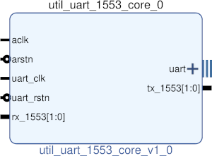

# UTIL UART 1553 CORE
## Wrapper for all UART MIL-STD-1553 cores
---

   author: Jay Convertino   
   
   date: 2021.06.28  
   
   details: Wrapper for all UART to MIL-STD-1553 cores. Allows for simple insertion into projects.  
   
   license: MIT   
   
---

### IP USAGE
#### INSTRUCTIONS

Core contains all the pieces needed to generate a mil-std-1553 signal for UART data.  
It will also decode mil-std-1553 data and send a string contraining the caputure over UART.  

#### PARAMETERS
* clock_speed : DEFAULT = 2000000 : Clock speed of aclk in hz.
* uart_baud_clock_speed : DEFAULT = 2000000 : Clock speed of the uart gen clock in hz.
* uart_baud_rate : DEFAULT = 2000000 : Target baud rate for UART in hz.
* uart_parity_ena : DEFAULT = 1 : Enable uart parity.
* uart_parity_type : DEFAULT = 1 : Set the parity type, 0 = even, 1 = odd, 2 = mark, 3 = space.
* uart_stop_bits : DEFAULT = 1 : Number of stop bits, 0 to crazy non-standard amounts.
* uart_data_bits : DEFAULT = 8 : Number of data bits, 1 to crazy non-standard amounts.
* uart_rx_delay : DEFAULT = 3 : Delay in rx read. Should be middle of input data (baud_clock_speed/baud_rate/2).
* mil1553_sample_rate : DEFAULT = 2000000 : sample rate of generated signal in hz (minimum 2 MHz).
* mil1553_rx_bit_slice_offset : DEFAULT = 0 : after data caputre, offset bit to use from capture (only works with higher sample rates, positive only).
* mil1553_rx_invert_data : DEFAULT = 0 : Invert data, default 0 no inversion. 1 or above is inverted data.
* mil1553_rx_sample_select : DEFAULT = 0 : Select whatever sample from rates that take multiple samples (clock_speed/sample_rate = number of samples to select from).

### COMPONENTS
#### SRC

* util_uart_1553_core.v
  
#### TB

* tb_core.v
  
### Makefile

* Capable of generating simulations and ip cores for the project.

#### Usage

#### Subprojects

* make txd  ??? - generate sim for txd only, ??? is optional and can be xsim or icarus.
* make rxd  ??? - generate sim for rxd only, ??? is optional and can be xsim or icarus.
* make baud ??? - generate sim for baudd only, ??? is optional and can be xsim or icarus.

##### Icarus

* make icarus      - Generate project using Icarus.
* make icarus_sim  - Simulate project using Icarus.
* make icarus_view - Open GTKwave to view simulation.

##### XSim (Vivado)

* make xsim      - Generate Vivado project for simulation.
* make xsim_view - Open Vivado to run simulation.
* make xsim_sim  - Run xsim for a certain amount of time.
  * STOP_TIME ... argument can be passed to change time that the simulation stops (+1000ns, default vivado run time).
  * TB_ARCH ... argument can be passed to change the target configuration for simulation.
* make xsim_gtkwave_view - Use gtkwave to view vcd dump file.

##### IP Core (Vivado)

* make - Create Packaged IP core for Vivado, also builds all sims.
