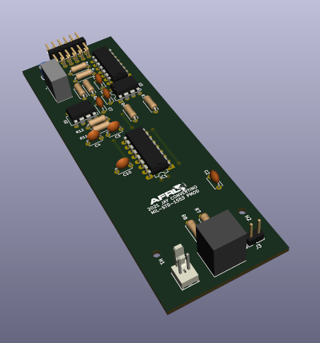

# open1553

Respository of open source 1553 designs for the pmod1553 device.

author: Jay Convertino   
   
date: 2021.07.29  
   
details: FPGA devices used via a PMOD mil-std-1553 electrical interface device to decode and encode 1553 transmissions.  
   
license: Various   
   
Special thanks to Analog Devices, their HDL build system is fantastic. I've used it with modifications in the HDL directory.  
   

## RELEASE VERSIONS
### Current
  - release_1553_v2 (releases are tags)
    * added analog switch for proper 1553 multiplexing
    * added en_diff for switch toggling
  
### Past
  - release_1553_v1 (releases are tags)
    * first public release

## Requirements
### HDL
  - Vivado 2018.3.1
  - Icarus
  
### Software
  - GCC
  - DTC
  
## Quick Start
0. fifo_pmod1553/fmc1553 projects require linux. See docs folder for creating SDCARD.
1. Install Vivado 2018.3.1
2. Install build essentials package for Ubuntu.
3. From the root of the HDL directory you may run the following build commands.
    - make uart_pmod1553.arty-a7-35
    - make uart_pmod1553.cmod-s7-25
    - make fifo_pmod1553.zedboard
    - make fifo_pmod1553.zcu102
    - make fifo_pmod1553.zybo (OLD ZYBO NOT Z7)
    - make fmc1553.zcu102
4. Once completed you may use Vivado to open the project (xpr will be in the project folder root). To program your development board via JTAG.
    - You will need to add a memory configuration device to write the bitstream to the flash of the cmod/arty.
    - cmod example at: https://reference.digilentinc.com/learn/programmable-logic/tutorials/cmod-a7-programming-guide/start?_ga=2.262285964.1885041324.1628539712-1298016575.1609856716
    - Again, for the fifo/fmc projects you oned to build the linux system. See the docs folder for instructions.
  
## USAGE
### General Usage

For xilinx fifo and uart the format is the same.   
Data is received in the following ASCII string format:  
>CMDS;D1;P1;I0;Hx5555\r  
>DATA;D0;P1;I0;HxAAAA\r  

The fields are seperated by ; .   
  
  - The first is the sync type, Command/Status = CMDS, Data = DATA
  - The second is if there is a 4us delay, 1 = delay over 4us, 0 = no delay or less then 4us.
  - The third is parity, 1 = parity good, 0 = parity bad
  - The fourth is invert, 1 = core is inverting data, 0 = core is not inverting data
  - The fifth is the data in hex format, Hx???? where ? = 4 bits of data (16 bits in total).
  - The carrige return is the string terminator. This works well with serial consoles with local newline addition enabled.
      - tr '\r' '\n' is your friend for xilinx fifo applications.
      
Data is sent in the following ASCII string format:  
>CMDS;D1;P1;I0;Hx5555\r  
>DATA;D0;P1;I0;HxAAAA\r  

The fields are seperated by ; .   
  
  - The first is the sync type, Command/Status = CMDS, Data = DATA
  - The second is to enable a 4us delay, 1 = delay of at least 4us, 0 = no delay or less then 4us.
  - The third is parity, 1 = parity odd (default), 0 = parity even
  - The fourth is invert, 1 = invert data, 0 = don't invert data
  - The fifth is the data in hex format, Hx???? where ? = 4 bits of data (16 bits in total).
  - The carrige return is the string terminator.
      - echo -ne "DATA;D1;P1;I0;Hx5555\r" is your friend for xilinx fifo applications.

## DIRECTORIES
### docs

Helpful documents for the open1553 systems.

The subfolder diagrams contains high level block diagrams of the 1553 data flow.

The subfolder linux_build contrains documents for Linux on the Zedboard, ZCU102,   
and other targets.

### apps

Example applications for using the uart/fifo1553 in with python. Won't set the world   
on fire performance wise, but shows how quickly something can be put together.

Python2 seems to be the best for fifo1553, python3 seems to be the best for the uart1553.  

### hardware

Hardware design and information for the pmod_1553 device.   
This design is drafted in KiCAD version 5.x.   

Open the KiCAD project file in hardware/pmod/kicad. This will allow you to  
look over the schematic and board design. You may then export it to whatever format   
needed for your PCB manufacturing process.  

### HDL

FPGA files for pmod_1553 projects. It contains libraries that are the  
actual code for IP cores, and projects that generate for target boards.  
Currently Supported:   

  - Digilent Arty 35T (UART DEVICE)
  - Digilent CMOD S7  (UART DEVICE)
  - Digilent Nexys A7 100t (UART DEVICE)
  - Zedboard (Xilinx FIFO pmod1553)
  - Zybo ORIGINAL (Xilinx FIFO pmod1553)
  - ZCU102 (Xilinx FIFO fmc1553)
  - ZCU102 (Xilinx FIFO pmod1553)

The original source for the HDL build system is from Analog Devices, all copyrights   
are there own and I claim no ownership of their code.

The original code has been altered and simulation capibility added.

HDL code built with Vivado 2018.3.1

The HDL build systems requires both Vivado and Icarus if you run a make all.   
If you make individual projects or cores you or may not need icarus. Vivado is a  
hard requirement.

Example:
>make uart_pmod1553.arty-a7-35

Will only run vivado to generate the target.   

See IP core (library folder) for details on simulation and usage.

### linux

Linux is for Xilinx AXIS FIFO projects, or any future Linux based designes.

axisfifo is a repository that contains the linux kernel driver source code for the   
Xilinx Axis FIFO ip. This has been included in the linux_kernel dev_fmc1553 branch   

zed/zcu102 is a folder of files to generate the boot binary. You may use the bootgen_files   
to create a new BOOT.bin. BOOT.bin is a complete build for the 2019_R1 release that can be  
used on the zedboard as is with the Analog Devices SDCARD image. The device three is also  
included in the same folder.    

The reference base image file is included for SDCARD imaging. (2019_R1-2020_06_22.img.xz)

## FUTURE
Todo list for v3
  - Consider adding high speed opamps to receive and transmit paths.
  - Add AXI core with custom linux driver for MIL-STD-1553 core.
    - Option between string and binary output.
    - Add ability to manipulate clock waveform... for fun. (v3.X)
  - High Speed C program to act as bus controller/remote terminal (v3.X)
